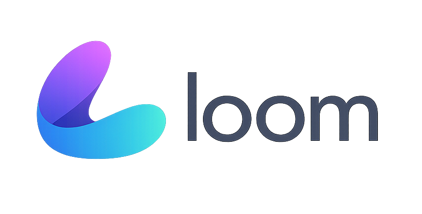

<p align="center">
  
</p>

<h1 align="center">Loom</h1>

<p align="center">
  <strong>AI Agent Orchestrator for Beads</strong>
</p>

<p align="center">
  <em>"Beads are the task, Loom is what weaves them together"</em>
</p>

---

Loom is an orchestration layer built on top of [Beads (bd)](https://github.com/steveyegge/beads/tree/main) that enhances AI coding agents with intelligent task prioritization, lifecycle hooks, multi-agent coordination, and learning capabilities.

## Prerequisites

Before installing Loom, ensure you have the following dependencies installed:

1. **[Beads (bd)](https://github.com/steveyegge/beads/tree/main)** - Distributed graph-based issue tracker for AI agents
2. **[Dolt](https://github.com/dolthub/dolt)** - Version-controlled SQL database (required by Beads)

## Features

- **Smart Prioritization** - Score tasks by downstream impact, staleness, and failure history
- **Lifecycle Hooks** - Inject context, validate commands, auto-create follow-ups
- **Multi-Agent Coordination** - File-level locking and conflict detection
- **Learning System** - Retrospectives and pattern extraction for continuous improvement
- **Memory Management** - Intelligent compaction to preserve important context

## Installation

```bash
# Clone and build
git clone https://github.com/uttufy/loom.git
cd loom
go build ./cmd/loom

# Or install directly
go install github.com/uttufy/loom/cmd/loom@latest
```

## Quick Start

```bash
# Initialize configuration
loom config init

# View prioritized ready tasks
loom ready

# Start the orchestration loop
loom run
```

## CLI Commands

| Command | Description |
|---------|-------------|
| `loom run` | Start the orchestration loop |
| `loom ready` | Show prioritized ready tasks |
| `loom score <issue-id>` | Show task score breakdown |
| `loom claim <issue-id> [files...]` | Claim a task with file declarations |
| `loom locks` | Show current file locks |
| `loom conflicts` | Detect potential conflicts |
| `loom retro list` | List recent retrospectives |
| `loom patterns` | List learned patterns |
| `loom hooks list` | List registered hooks |
| `loom status` | Show context usage and stats |

## Configuration

Loom is configured via `loom.yaml`:

```yaml
beads:
  path: bd
  timeout: 30s

scoring:
  blocking_multiplier: 3
  priority_boost: 2
  staleness_days: 3

hooks:
  enabled: true

safety:
  block_destructive: true

coordination:
  enabled: true
  lock_timeout: 1h

learning:
  enabled: true
```

## Documentation

- [Architecture](./docs/ARCHITECTURE.md) - System design and components
- [API Reference](./docs/API.md) - Public API documentation
- [Hooks](./docs/HOOKS.md) - Hook system details
- [MCP Integration](./docs/MCP.md) - Claude Code integration

## Credits

Loom is built on top of [Beads](https://github.com/steveyegge/beads/tree/main) by [Steve Yegge](https://github.com/steveyegge). Beads provides the distributed graph-based issue tracking foundation that makes AI agent coordination possible.

## License

[MIT](LICENSE)
